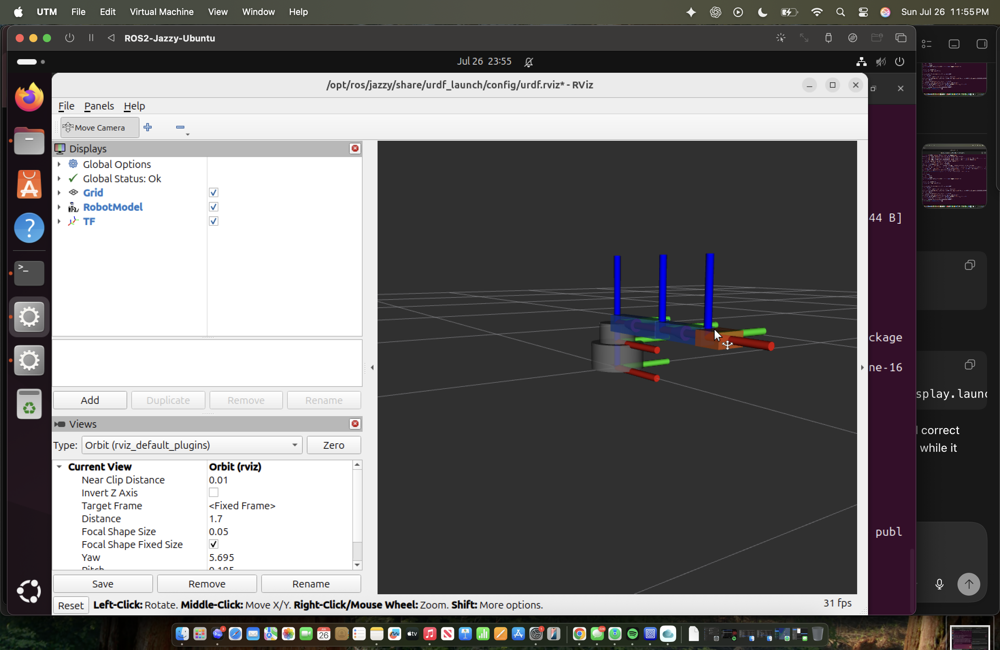

# ROS 2 Progress — 3-DOF Robotic Arm

## Current milestone

- Built a working ROS 2 Jazzy development environment on Ubuntu 24.04 ARM64.
- Created and validated a reusable ROS 2 robot-description package.
- Modeled the arm as an eight-link URDF/Xacro kinematic chain with five commanded joints and one mimic joint.
- Published the robot state and TF tree and rendered the placeholder arm successfully in RViz.
- Integrated the SolidWorks base, waist, upper-arm, forearm, wrist, and complete neutral-pose gripper geometry into the robot model.
- Extracted a 120 mm shoulder-to-elbow spacing from the upper-arm CAD geometry.
- Split the rigid `wrist_gripper_link` into `wrist_link`, `gripper_base_link`, and two moving gripper sides.
- Added `wrist_joint` and `gripper_joint`, with the opposing gripper side driven by a mimic joint.
- Current phase: verify the five joint controls in RViz, then add collision and inertial properties.

> **Terminology.** This is an RViz *kinematic visualization*, not a physics simulation. It runs
> `robot_state_publisher`, `joint_state_publisher_gui`, and RViz. Gazebo Sim and `ros2_control` are
> not implemented yet, so nothing here computes mass, contact, or gravity.



## Step 1 — Set up the ROS 2 environment

**Completed**

- Created an Ubuntu 24.04 ARM64 virtual machine with UTM on an Apple Silicon Mac.
- Installed ROS 2 Jazzy Desktop and the ROS development tools.
- Configured the shell to source ROS automatically.
- Verified node-to-node communication with the ROS talker/listener examples.

**What I learned**

- How ROS 2 packages are installed and sourced in a Linux environment.
- How nodes communicate through topics using a publisher/subscriber model.
- How to diagnose ARM64 package, shell, and software-rendering issues in a virtual machine.

## Step 2 — Create the workspace and package

**Completed**

- Created a colcon workspace at `~/robot_arm_ws`.
- Created the `robot_arm_description` package using `ament_cmake`.
- Added `urdf`, `STL`, `launch`, and `rviz` resource directories.
- Configured CMake to install the robot-description resources with the package.

**What I learned**

- The purpose of the `src`, `build`, `install`, and `log` workspace directories.
- How `colcon`, `ament_cmake`, `package.xml`, and `CMakeLists.txt` work together.
- Why a workspace must be rebuilt and sourced after package changes.

## Step 3 — Build and validate the first URDF/Xacro model

**Completed**

- Defined the initial kinematic chain:
  - `base_link`
  - `waist_link`
  - `upper_arm_link`
  - `forearm_link`
  - `wrist_gripper_link`
- Defined three revolute joints: base yaw, shoulder pitch, and elbow pitch.
- Added provisional joint origins, rotation axes, and motion limits.
- Used Xacro properties for reusable arm dimensions.
- Generated a URDF and verified the XML and link/joint tree with `check_urdf`.

**What I learned**

- How URDF represents a robot as a parent-child tree of links and joints.
- How joint origins, axes, and limits determine the arm's motion.
- How Xacro makes dimensions and repeated model elements easier to maintain.
- How to validate a model before attempting visualization or control.

## Step 4 — Publish and visualize the robot

**Completed**

- Used `robot_state_publisher` to publish the robot's link transforms.
- Used `joint_state_publisher_gui` to generate test joint positions.
- Visualized the robot model and TF axes in RViz.
- Configured software OpenGL rendering for reliable RViz operation in UTM.
- Corrected a launch parameter type issue by passing the generated URDF as an explicit string.

**What I learned**

- The difference between joint states and the TF transform tree.
- How `robot_state_publisher`, `joint_state_publisher_gui`, and RViz work together.
- How to interpret RViz fixed frames, RobotModel status, and TF output while debugging.
- How a ROS 2 launch file starts and configures several nodes as one system.

## Reproduce the current milestone

```bash
cd ~/robot_arm_ws
colcon build --symlink-install --packages-select robot_arm_description
source install/setup.bash
LIBGL_ALWAYS_SOFTWARE=1 ros2 launch robot_arm_description display.launch.py
```

## Next steps

### Step 5 — Export the SolidWorks geometry

**Completed so far**

- Exported the base, waist, and upper arm as meter-scaled binary STL files; the forearm, wrist, and normalized gripper parts remain in SolidWorks millimeters and are scaled by Xacro.
- Validated all nine unique mesh files' dimensions, orientation, binary structure, watertightness, and reference origin before integration.
- Kept the upper-arm origin at the shoulder pivot and measured a 120 mm shoulder-to-elbow distance from the CAD geometry.
- Derived the forearm transform from the STEP assembly and converted its millimeter geometry to ROS meters in Xacro.
- Added all nine unique meshes to `robot_arm_description/STL` with documented ROS frame corrections; the gear, connecting-link, and finger meshes are each instantiated twice from the STEP assembly.

**What I learned**

- How STL export units affect robot scale in RViz.
- Why a joint-centered mesh origin makes URDF placement and motion easier to understand.
- How to correct SolidWorks-to-ROS axis differences using a URDF `origin` rotation instead of modifying the CAD geometry.
- How to validate mesh dimensions and orientation before debugging them in ROS.

**Remaining**

- Verify the complete wrist and gripper geometry in RViz against the STEP assembly.

### Step 6 — Match the ROS model to the CAD assembly

- Replaced the placeholder base, waist, upper arm, and forearm with their corresponding SolidWorks meshes.
- Updated the provisional shoulder-to-elbow distance from 220 mm to the CAD-derived 120 mm value.
- Verify the base, waist, upper-arm, and forearm meshes together in RViz.
- Completed: replaced the gripper placeholder with Link #3 and all seven gripper part instances from the CAD assembly.
- Measure and enter the remaining exact joint origins and rotation axes.
- Replace provisional motion limits with the physical servo/link limits.
- Confirm that each RViz joint moves in the correct direction without separating the assembly.

### Step 6b — Split the wrist and gripper into moving joints

**Completed**

- Replaced the single fixed `wrist_gripper_link` with four links: `wrist_link`, `gripper_base_link`,
  `left_gripper_link`, and `right_gripper_link`.
- Added `wrist_joint` (revolute) between the forearm and the wrist, using the STEP wrist frame.
- Added `gripper_joint` (revolute) as the single commanded gripper control, and
  `right_gripper_joint` as a mirrored `mimic` joint so the GUI exposes exactly five sliders.
- Kept every joint's zero position at the STEP neutral pose. A static check confirms the split model
  reproduces the previous single-link placement of all twelve visuals to within 1.04 nanometres,
  which is the rounding of the previous file's nine-decimal literals rather than a modelling error.

**Engineering notes**

- The wrist frame's Y axis maps exactly onto the forearm frame's Y axis, so `wrist_joint` pitches in
  the same plane as the shoulder and elbow. Its axis is `0 1 0`.
- Both gripper gear frames share one spin axis: their local Z axes are exactly anti-parallel in the
  gripper-base frame (dot product −1.000000), which is the meshing-gear signature. Because they are
  anti-parallel, driving both sides with the *same* signed angle counter-rotates them in world space,
  so the mimic multiplier is `+1`, not `−1`.
- The STEP neutral pose is the **closed** gripper: fingertip separation is 2.65 mm at zero. Positive
  rotation opens the jaws, reaching roughly 49 mm of separation at the provisional 0.30 rad limit.

**Known approximation**

- The real gripper is a geared four-bar closed loop. URDF cannot express a closed kinematic chain, so
  each side is modelled as one rigid gear/connector/finger group pivoting about its gear axis. The
  connector and finger do not articulate relative to their gear. This is a tree-safe visual and
  workspace approximation, not a mechanism simulation.

**Provisional values, not measurements**

- `wrist_joint` limits are ±1.5708 rad and `gripper_joint` limits are 0 to 0.30 rad. Both are
  conservative placeholders chosen from the geometry, not measured mechanical stops.

### Step 7 — Add engineering properties

- Add simplified collision geometry for each link.
- Add the measured mass, center of mass, and inertia for each moving link.
- Compare calculated joint torque requirements against the selected servos.

### Step 8 — Add control and simulation

- Create a `ros2_control` configuration for the three arm servos and gripper.
- Test joint commands in simulation before connecting hardware.
- Add a microcontroller interface for servo commands and joint feedback.
